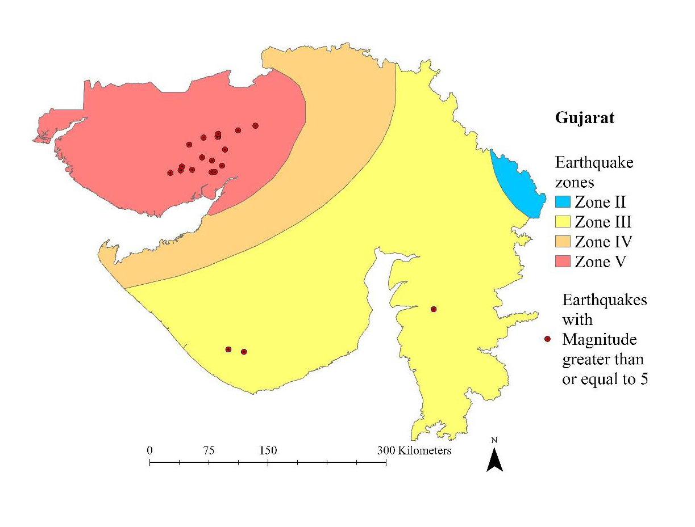
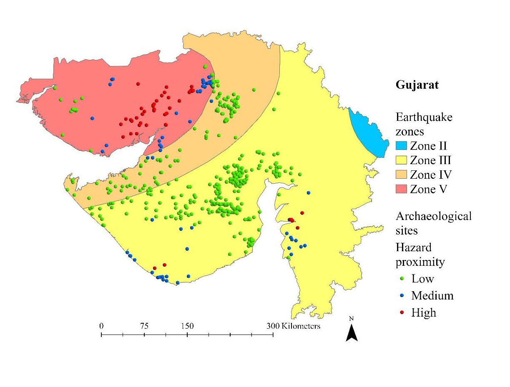
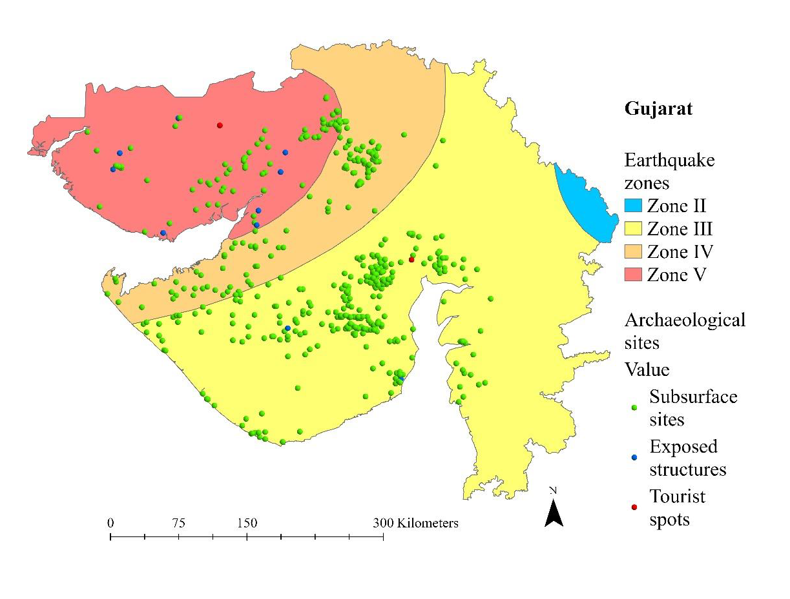
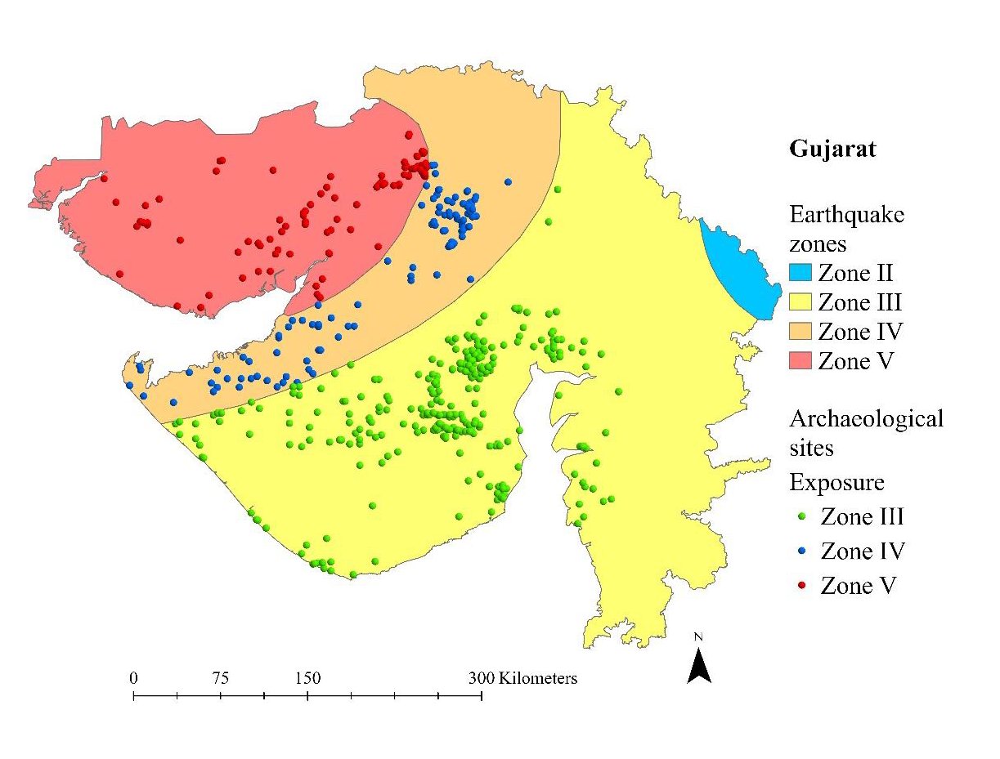
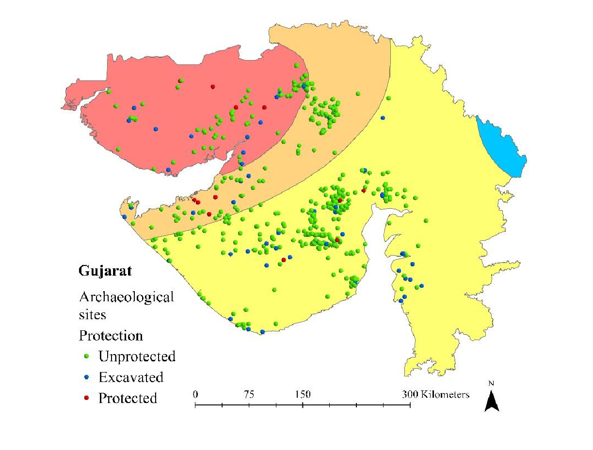
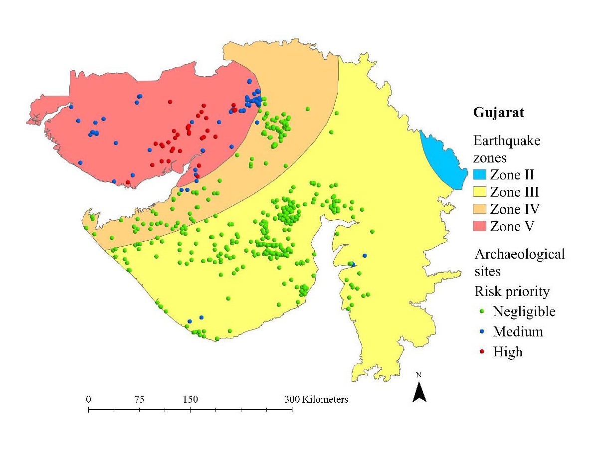
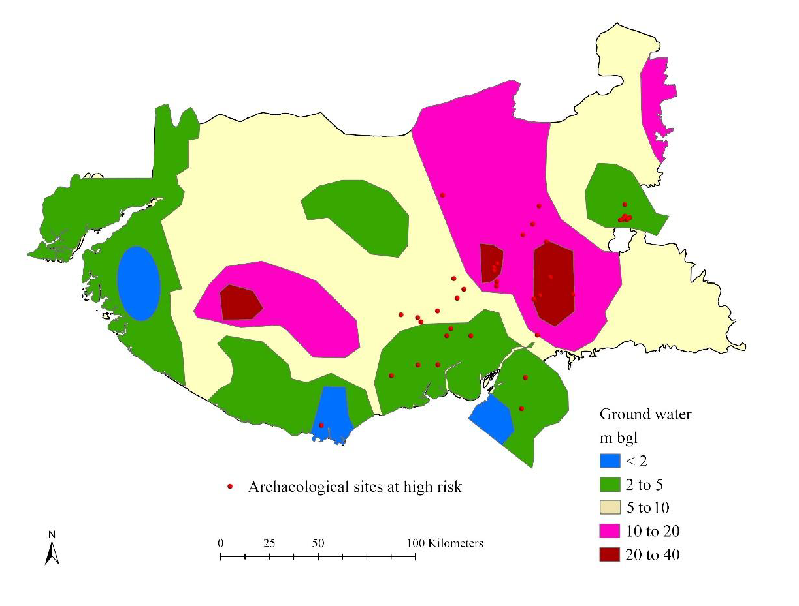
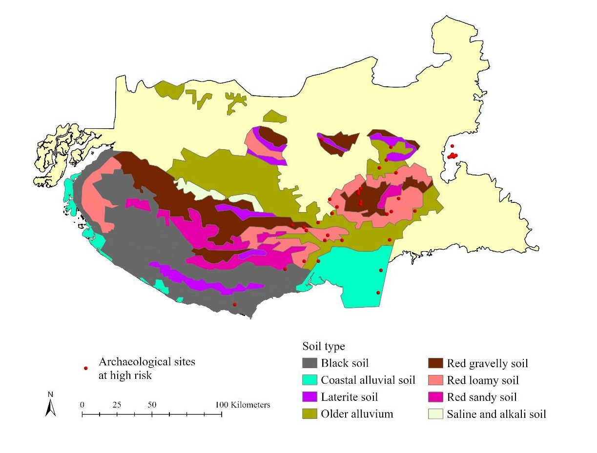
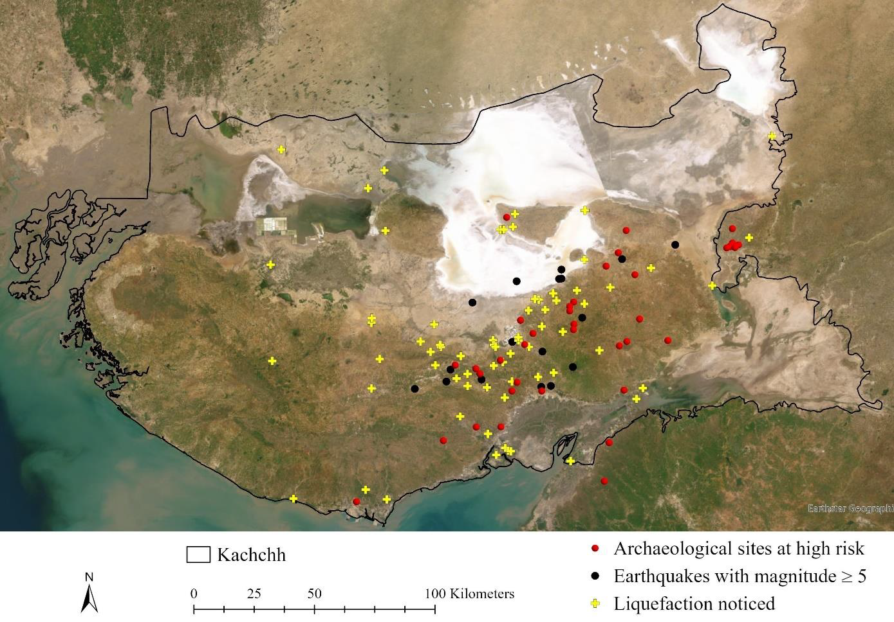
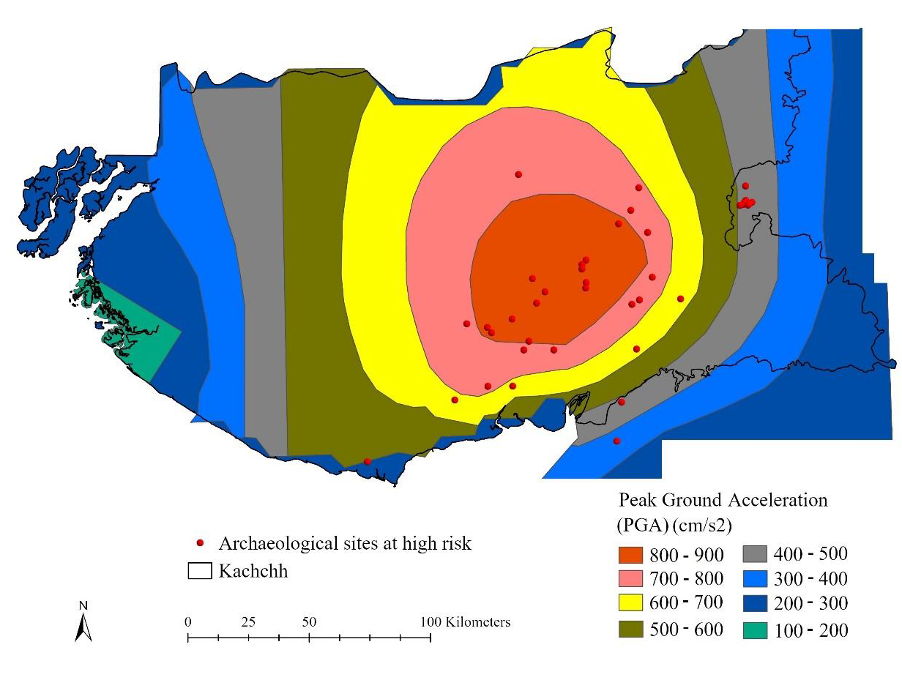

# Methodology

## Earthquake Risk Assessment of Archaeological Sites in Gujarat

## Overview

Gujarat is one of the most seismically active regions of India due to its location near the convergence zone of the Indian and Eurasian tectonic plates. The Indian plate continues to move northward and collide with the Eurasian plate, resulting in active fault systems and frequent seismic activity. The state is divided into Seismic Zones III, IV, and V, with Zone V representing the highest earthquake hazard.

Earthquakes can cause severe damage to archaeological heritage through structural collapse, ground shaking, liquefaction, soil deformation, and displacement of archaeological deposits. To evaluate the potential impact of earthquakes on archaeological sites, a GIS-based earthquake risk assessment framework was developed.

The methodology integrates hazard, value, and vulnerability indicators using the following equation:

## Earthquake Risk Equation

`Risk = Hazard × Value × Vulnerability`

Where:

- **Hazard** represents earthquake potential around archaeological sites.
- **Value** represents the archaeological significance and importance of sites.
- **Vulnerability** represents the susceptibility of sites to earthquake impacts.

---

# 1. Earthquake Hazard Assessment

## 1.1 Historical Earthquake Database

Historical earthquake records with magnitudes greater than or equal to 5.0 occurring since 1950 were obtained from the United States Geological Survey (USGS).

The earthquake catalogue was used to identify seismic hotspots and evaluate the spatial relationship between archaeological sites and historical earthquake epicentres.

## Earthquakes with Magnitude ≥ 5 in Gujarat Since 1950

---

## 1.2 Hazard Mapping

Earthquake hazard was measured using proximity to earthquake epicentres.

Euclidean distance analysis was performed to calculate the distance between archaeological sites and historical earthquake events.

Sites located closer to earthquake epicentres were assigned higher hazard scores.

### Hazard Scoring

| Hazard Category | Distance from Epicentre | Score |
|----------------|-------------------------|-------|
| Low | ≥ 60 km | 1 |
| Medium | 30–60 km | 2 |
| High | ≤ 30 km | 3 |

Higher scores indicate greater earthquake hazard.

## Earthquake Hazard Proximity

---

# 2. Site Value Assessment

The value component was used to estimate the potential consequences of earthquake-related damage to archaeological heritage.

Two indicators were considered:

- Physical structure
- Tourism potential

Archaeological sites were classified into three categories.

### Value Scoring

| Site Type | Description | Score |
|------------|-------------|-------|
| Subsurface Sites | Sites without visible archaeological structures | 1 |
| Above-Ground Sites | Sites containing visible archaeological remains | 2 |
| Heritage and Tourism Sites | Sites with visible remains and tourism significance | 3 |

Examples of high-value sites include Dholavira and other archaeological destinations with visible structural remains and tourism importance.

## Site Value Assessment

---

# 3. IPCC Vulnerability Framework

Vulnerability was assessed using the Intergovernmental Panel on Climate Change (IPCC) framework.

According to the IPCC, vulnerability is a function of:

- Exposure
- Sensitivity
- Adaptive Capacity

The relationship is expressed as:

## Vulnerability Equation

`Vulnerability = Exposure + Sensitivity − Adaptive Capacity`

Where:

- **Exposure** represents the presence of archaeological sites in earthquake-prone areas.
- **Sensitivity** represents the degree to which archaeological sites are susceptible to earthquake impacts.
- **Adaptive Capacity** represents the ability of archaeological sites and management systems to cope with earthquake hazards.

Higher exposure and sensitivity increase vulnerability, whereas higher adaptive capacity reduces vulnerability.

---

# 4. Cultural Heritage Vulnerability Assessment

The IPCC framework was adapted for archaeological heritage assessment.

For cultural heritage:

### Exposure

Exposure refers to the location of archaeological sites within earthquake-prone zones.

### Sensitivity

Sensitivity refers to the physical condition, preservation state, and susceptibility of archaeological remains.

### Adaptive Capacity

Adaptive capacity refers to the ability of heritage management systems to respond to hazards through conservation measures, institutional support, monitoring, and legal protection.

---

# 5. Earthquake Vulnerability Assessment

Vulnerability was calculated using three indicators:

1. Exposure
2. Sensitivity
3. Adaptive Capacity

---

## 5.1 Exposure Assessment

Exposure was measured using Gujarat's seismic zonation.

The state falls within three earthquake zones:

- Zone III
- Zone IV
- Zone V

Zone V represents the highest level of seismic hazard.

### Exposure Scoring

| Earthquake Zone | Score |
|---------------|-------|
| Zone III | 1 |
| Zone IV | 2 |
| Zone V | 3 |

## Exposure

---

## 5.2 Sensitivity Assessment

Sensitivity was assessed using the preservation status of archaeological sites.

### Sensitivity Scoring

| Site Condition | Score |
|---------------|-------|
| Subsurface Sites and Mounds | 1 |
| Sites Exposed to Environmental Processes | 2 |
| Sites Previously Damaged or Located in Croplands | 3 |

Higher scores indicate greater sensitivity to earthquake damage.

---

## 5.3 Adaptive Capacity Assessment

Adaptive capacity was evaluated using the legal protection and management status of archaeological sites.

Protected sites generally possess stronger institutional support and conservation mechanisms.

### Adaptive Capacity Scoring

| Protection Status | Score |
|------------------|-------|
| Unprotected Sites | 1 |
| Excavated Sites | 2 |
| World Heritage Sites, Centrally Protected Sites, and State Protected Sites | 3 |

Higher adaptive capacity reduces overall vulnerability.

## Adaptive Capacity

---

## 5.4 Vulnerability Scoring Matrix

### Table 10. Vulnerability Assessment Framework

| Score | Exposure | Sensitivity | Adaptive Capacity |
|---------|-----------|------------|------------------|
| 1 | Zone III | Subsurface Sites and Mounds | Unprotected Sites |
| 2 | Zone IV | Sites Exposed to Environmental Processes | Excavated Sites |
| 3 | Zone V | Sites Damaged in the Past or Located in Croplands | World Heritage, Centrally Protected, and State Protected Sites |

The final vulnerability score was calculated using:

`Vulnerability = Exposure + Sensitivity − Adaptive Capacity`

---

# 6. Earthquake Risk Calculation

The final earthquake risk score was calculated using:

`Risk = Hazard × Value × Vulnerability`

The resulting scores were classified into three priority categories.

### Risk Classification

| Risk Category | Interpretation |
|--------------|---------------|
| Negligible | Low priority for intervention |
| Medium | Moderate risk requiring monitoring |
| High | High priority requiring conservation and mitigation measures |

## Archaeological Sites at Risk from Earthquakes

---

# 7. Liquefaction Susceptibility Analysis in Kachchh

The Kachchh region was analysed separately because of its high seismicity and the widespread liquefaction observed during the 2001 Bhuj Earthquake.

Liquefaction occurs when saturated soils lose strength and stiffness during intense earthquake shaking and temporarily behave like liquids.

The assessment considered:

- Groundwater depth
- Soil characteristics
- Historical liquefaction locations
- Peak Ground Acceleration (PGA)

---

## 7.1 Groundwater Depth

Groundwater depth plays a significant role in liquefaction susceptibility.

Areas with shallow groundwater tables are more susceptible because saturated sediments can rapidly lose strength during earthquake shaking.

## Groundwater Depth of Kachchh

---

## 7.2 Soil Characteristics

Soil texture and composition strongly influence liquefaction potential.

Alluvial, sandy, and loamy soils generally exhibit greater susceptibility to liquefaction than consolidated soils and rocky formations.

## Soil Map of Kachchh

---

## 7.3 Historical Liquefaction Locations

Documented liquefaction locations from previous earthquake events were compared with archaeological sites identified as high risk.

The comparison provides insight into the relationship between earthquake hazard, liquefaction occurrence, and archaeological site vulnerability.

## Locations of Liquefaction Observed in Kachchh

---

## 7.4 Peak Ground Acceleration (PGA)

Peak Ground Acceleration (PGA) represents the maximum ground acceleration generated during an earthquake.

Higher PGA values indicate stronger ground shaking and increased potential for structural damage.

## Peak Ground Acceleration of Kachchh

### Table 20. Peak Ground Acceleration and Groundwater Depth

| Site | PGA (cm/s²) | Groundwater Depth (m) |
|------|-------------|----------------------|
| Dholavira | 800 | <10 |
| Kanmer | 600 | 10–40 |
| Bagasra | 400 | 10–40 |
| Kuntasi | 300 | 10–40 |
| Remaining Sites | 300–800 | 5–40 |

---

# 8. Interpretation

The assessment identified central Kachchh as the region containing the highest concentration of earthquake-risk archaeological sites.

The elevated risk is associated with:

- High seismic activity
- Proximity to earthquake epicentres
- High Peak Ground Acceleration (PGA)
- Shallow groundwater conditions
- Liquefaction-prone soils

The analysis suggests that liquefaction and strong ground shaking are the primary earthquake-related threats affecting archaeological heritage within the region.

Prominent sites identified as being at high earthquake risk include:

- Dholavira
- Kanmer
- Bagasra
- Kuntasi

These sites should be prioritised for monitoring, conservation planning, disaster preparedness, and long-term risk mitigation.

