# Flood Risk Assessment of Gujarat Using GIS and Remote Sensing

*A GIS-based flood susceptibility modelling project using Remote Sensing, Analytical Hierarchy Process (AHP), and Weighted Overlay Analysis.*

---

## Overview

This project presents a flood susceptibility assessment of Gujarat, India, developed using Geographic Information Systems (GIS), Remote Sensing, and Multi-Criteria Decision Analysis (MCDA). The study was conducted as part of my PhD research at the Indian Institute of Technology Gandhinagar (IITGN).

The objective was to identify flood-prone areas by integrating environmental, topographic, hydrological, and land-use variables into a spatial flood susceptibility model. The resulting outputs support risk-informed planning, disaster management, and environmental decision-making.

---

## Objectives

* Develop a GIS-based flood susceptibility model for Gujarat.
* Integrate multiple environmental and terrain variables using Analytical Hierarchy Process (AHP).
* Generate a flood susceptibility map through weighted overlay analysis.
* Validate model performance using Area Under the Curve (AUC).
* Demonstrate the application of GIS and Remote Sensing for spatial risk assessment.

---

## Study Area

The study covers the state of Gujarat, India, which experiences recurring flood events due to monsoon rainfall, riverine flooding, and low-lying coastal environments.

---

## Methodology

The flood susceptibility model was developed using ten spatial parameters:

* Clay Content
* Distance from Rivers
* Distance from Roads
* Drainage Density
* Elevation
* Land Use Land Cover (LULC)
* Normalized Difference Vegetation Index (NDVI)
* Rainfall Deviation
* Slope
* Topographic Wetness Index (TWI)

The parameters were standardized, weighted using Analytical Hierarchy Process (AHP), and integrated through weighted overlay analysis to generate the final flood susceptibility map.

A detailed explanation of the workflow is available in [methodology.md](methodology.md).

---

## Key GIS Layers

### Clay Content

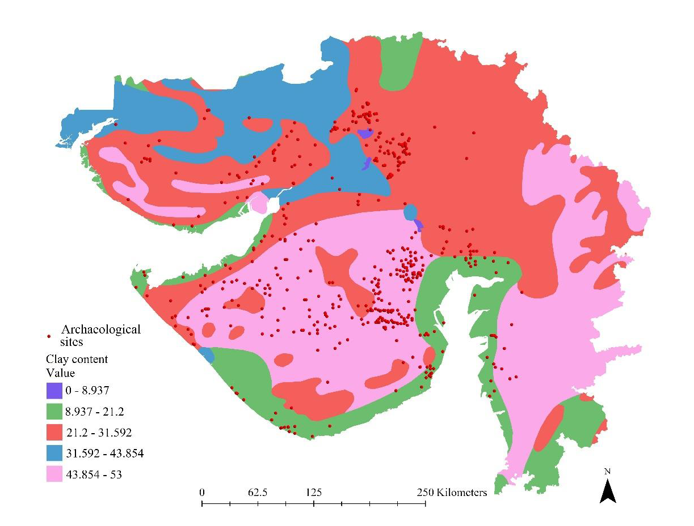

### Distance from Rivers

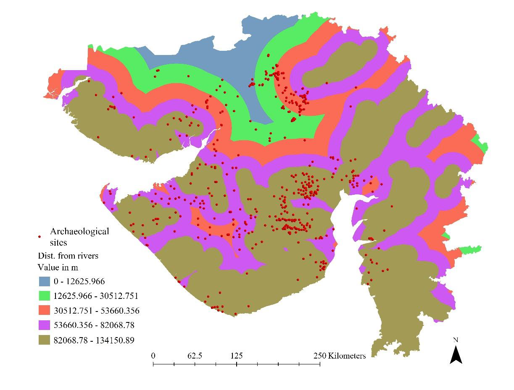

### Distance from Roads

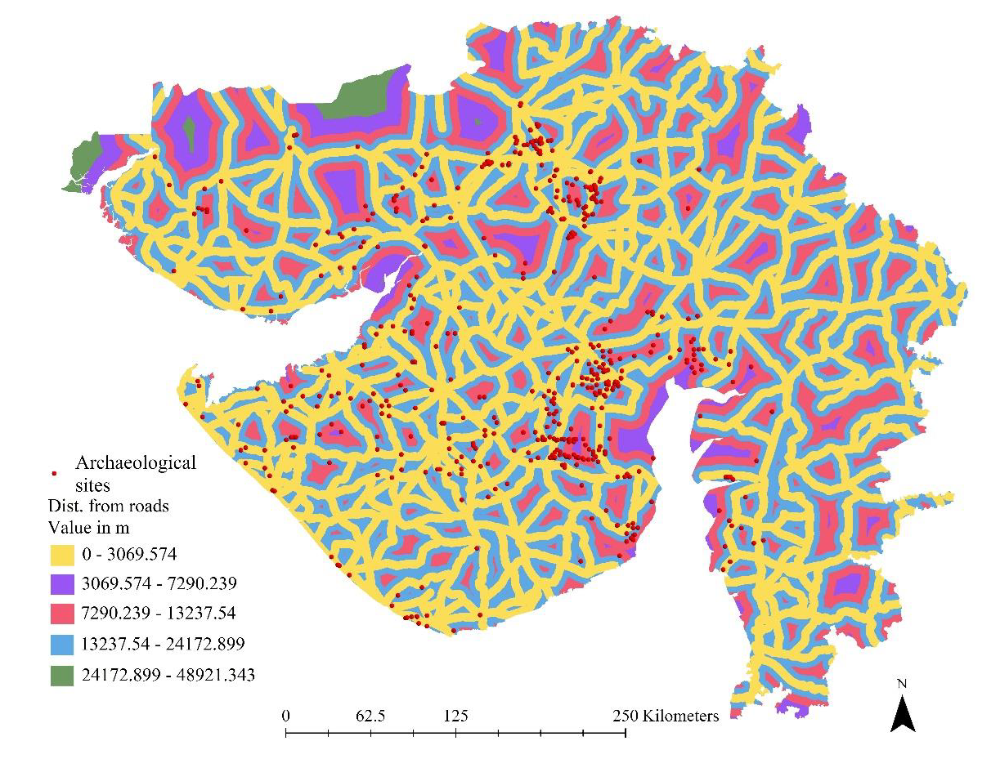

### Drainage Density

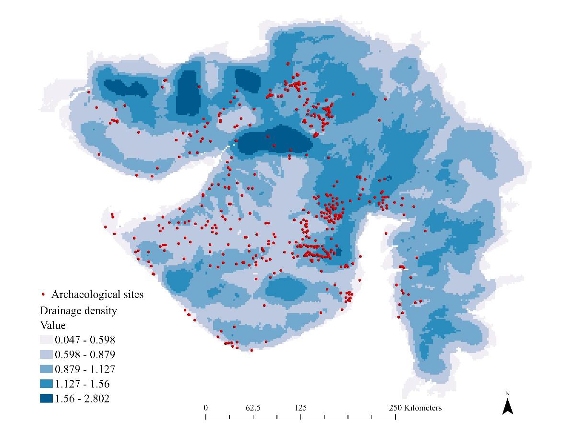

### Elevation

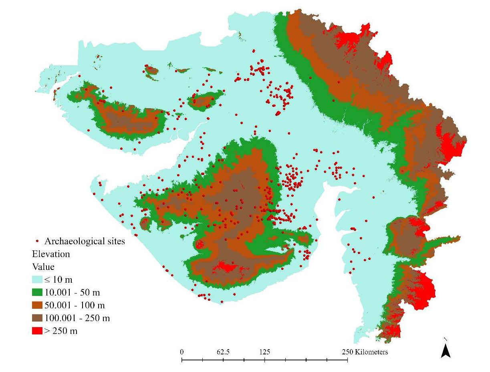

### Land Use Land Cover (LULC)

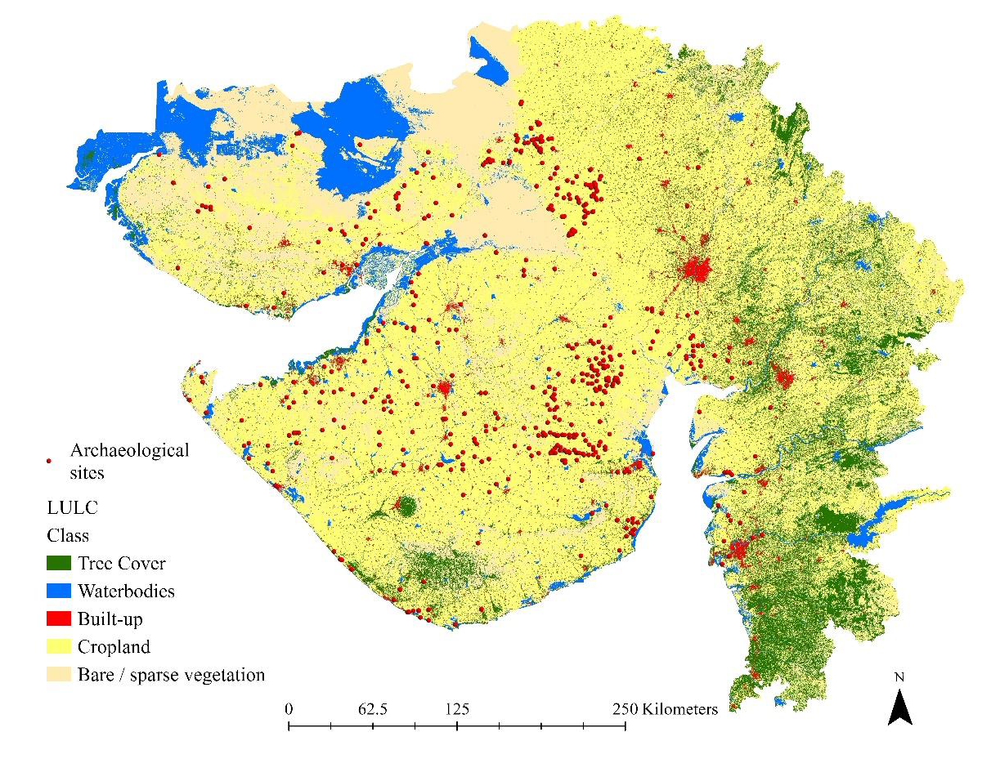

### NDVI

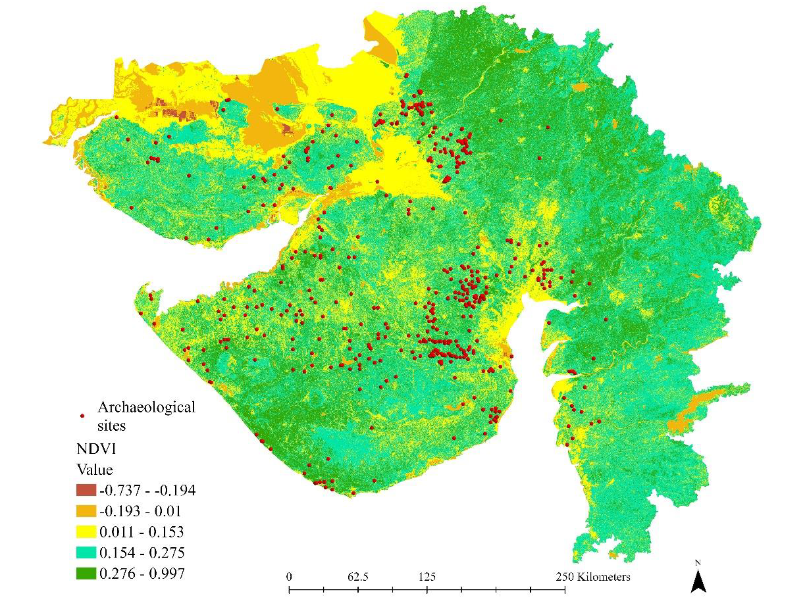

### Rainfall Deviation

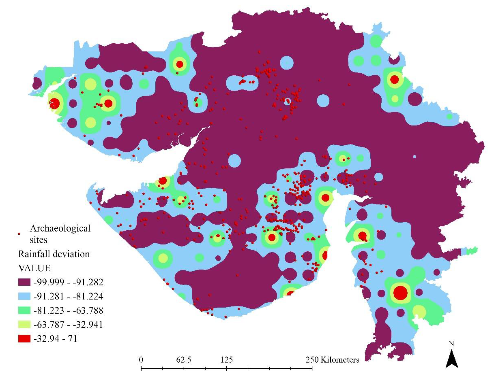

### Slope

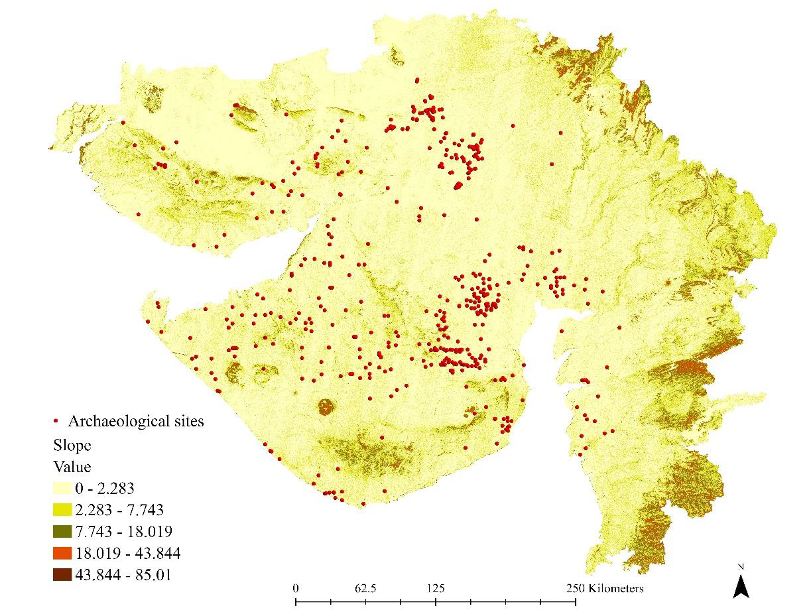

### Topographic Wetness Index (TWI)

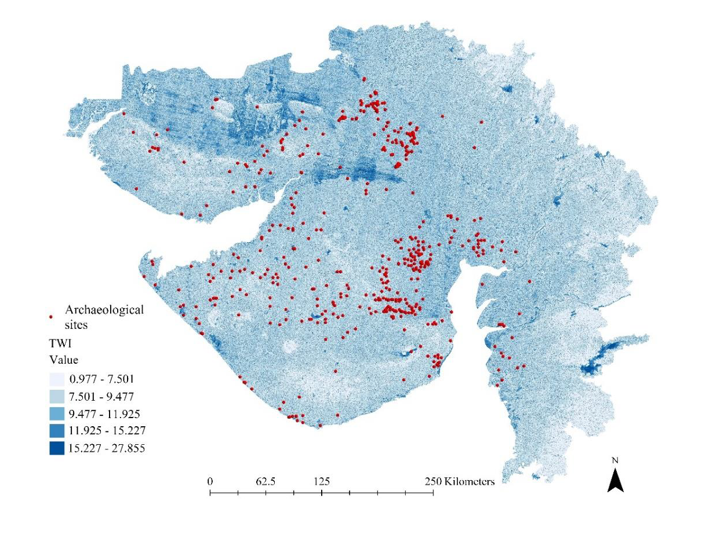

---

## Flood Susceptibility Model

The final flood susceptibility map identifies areas with varying levels of flood risk across Gujarat and demonstrates the integration of multiple environmental variables within a GIS-based decision-support framework.

---

## Model Validation

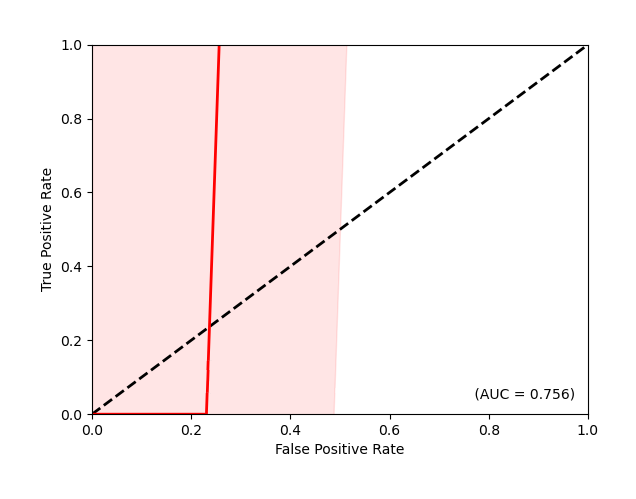

The model was evaluated using Area Under the Curve (AUC) analysis to assess predictive performance.

---

## Tools and Technologies

* ArcGIS Pro
* ArcGIS Spatial Analyst
* Remote Sensing Data
* Microsoft Excel
* Analytical Hierarchy Process (AHP)
* Weighted Overlay Analysis
* Multi-Criteria Decision Analysis (MCDA)

---

## Related Publication

This project is based on research published in the peer-reviewed journal *Geographia Technica*.

**Kadapa, H. (2025).** *A Geospatial Assessment of Flood Risk to Archaeological Sites Using Multicriteria Decision Making and Analytical Hierarchy Process*. Geographia Technica, 20(1), 281–297.

📖 Read the full article:

https://technicalgeography.org/index.php/on-line-first/533-19_kadapa

---

## Author

**Haritha Kadapa, PhD**

Indian Institute of Technology Gandhinagar

**Research Interests:**
GIS • Remote Sensing • Spatial Analysis • Environmental Modelling • Disaster Risk Assessment

