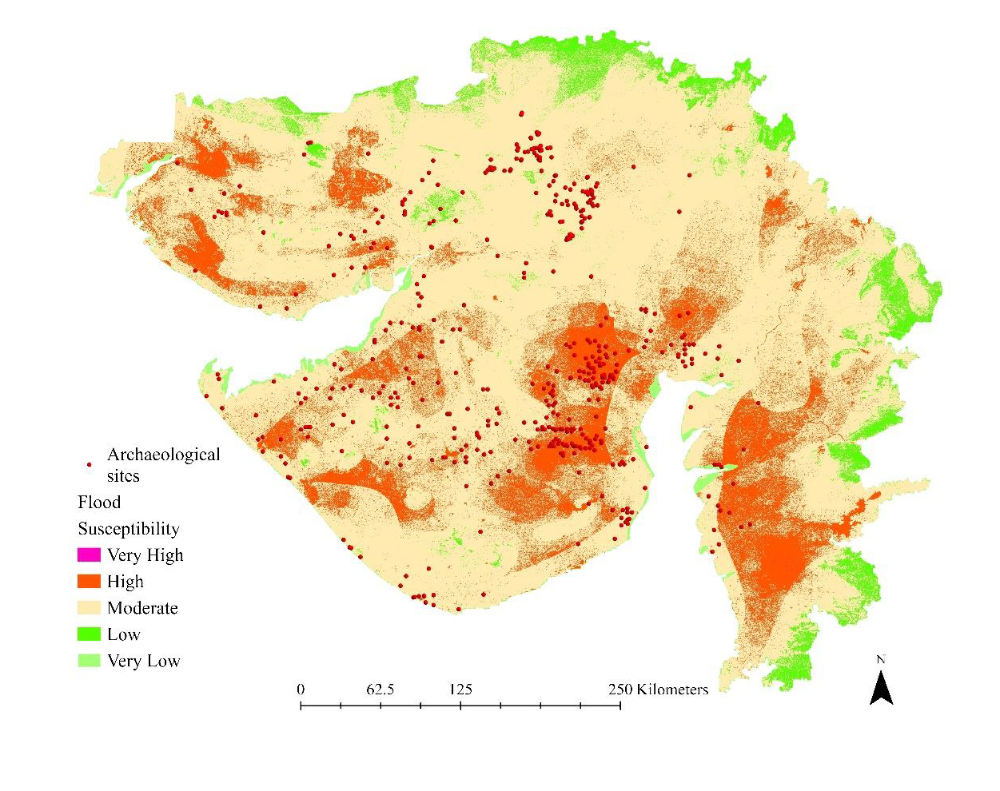

# Methodology

## Overview

This project applies Geographic Information Systems (GIS), Remote Sensing, and Multi-Criteria Decision Analysis (MCDA) to assess flood susceptibility across Gujarat, India. The methodology integrates environmental, hydrological, and topographic factors using the Analytical Hierarchy Process (AHP) and Weighted Overlay Analysis to generate a flood susceptibility map.

---

## Methodological Workflow

The overall workflow consisted of the following stages:

```text
Data Collection
       ↓
Generation of Thematic Layers
       ↓
Reclassification
       ↓
Analytical Hierarchy Process (AHP)
       ↓
Weighted Overlay Analysis
       ↓
Flood Susceptibility Mapping
       ↓
Multicollinearity Analysis
       ↓
Flood Risk Assessment
       ↓
Model Validation
```

---

## Flood Susceptibility Parameters

Ten conditioning factors were selected based on their influence on flood occurrence and hydrological behaviour.

| Parameter                       | Role in Flood Susceptibility                             |
| ------------------------------- | -------------------------------------------------------- |
| Clay Content                    | Influences infiltration and runoff generation            |
| Distance from Rivers            | Measures proximity to riverine flooding                  |
| Distance from Roads             | Represents infrastructure influence on drainage patterns |
| Drainage Density                | Indicates concentration of drainage networks             |
| Elevation                       | Identifies low-lying flood-prone areas                   |
| Land Use Land Cover (LULC)      | Captures surface characteristics affecting runoff        |
| NDVI                            | Represents vegetation density and infiltration potential |
| Rainfall Deviation              | Represents rainfall variability                          |
| Slope                           | Controls runoff velocity and water accumulation          |
| Topographic Wetness Index (TWI) | Indicates moisture accumulation potential                |

---

## Data Preparation

Spatial datasets were collected from multiple sources and processed within ArcGIS Pro. All layers were projected to a common coordinate system, clipped to the Gujarat boundary, and converted to a consistent raster format for analysis.

The workflow involved:

* Data acquisition
* Data preprocessing
* Raster generation
* Reclassification
* Weighted overlay modelling
* Validation

---

## Generation of Thematic Layers

### Clay Content

Clay-rich soils generally exhibit lower infiltration rates and higher surface runoff, increasing flood susceptibility.


---

### Distance from Rivers

Areas located closer to river channels are more vulnerable to riverine flooding.


---

### Distance from Roads

Road infrastructure can alter natural drainage pathways and influence flood behaviour.


---

### Drainage Density

Drainage density represents the total stream length per unit area and influences water concentration patterns.


---

### Elevation

Lower elevations are generally more susceptible to flooding due to reduced drainage potential.


---

### Land Use Land Cover (LULC)

Different land-cover classes influence infiltration, evapotranspiration, and runoff generation.


---

### NDVI

Normalized Difference Vegetation Index (NDVI) was used to quantify vegetation density.

NDVI was calculated as:

```text
NDVI = (NIR − Red) / (NIR + Red)
```

where:

* NIR = Near Infrared Band
* Red = Red Band


---

### Rainfall Deviation

Rainfall deviation was used to represent spatial variability in rainfall distribution.

Formula:

```text
Rainfall Deviation (%) =
((Recorded Rainfall − Average Rainfall) × 100)
/ Average Rainfall
```


---

### Slope

Slope influences runoff velocity and water accumulation.


---

### Topographic Wetness Index (TWI)

TWI is widely used to estimate the tendency of water accumulation across a landscape.

Formula:

```text
TWI = ln ( α / tanβ )
```

where:

```text
α = (Flow Accumulation + 1) × Cell Size
β = Slope Angle
```


---

## Reclassification

All thematic layers were reclassified into flood susceptibility classes before overlay analysis.

| Layer                | Reclassification Method |
| -------------------- | ----------------------- |
| Clay Content         | Natural Breaks (Jenks)  |
| Distance from Rivers | Natural Breaks (Jenks)  |
| Distance from Roads  | Natural Breaks (Jenks)  |
| Drainage Density     | Natural Breaks (Jenks)  |
| Elevation            | Manual Classification   |
| LULC                 | Land Cover Categories   |
| NDVI                 | Natural Breaks (Jenks)  |
| Rainfall Deviation   | Natural Breaks (Jenks)  |
| Slope                | Natural Breaks (Jenks)  |
| TWI                  | Natural Breaks (Jenks)  |

---

## Analytical Hierarchy Process (AHP)

The Analytical Hierarchy Process (AHP) was used to determine the relative importance of each flood conditioning factor.

A pairwise comparison matrix was constructed following Saaty's methodology.

### Saaty's Pairwise Comparison Scale

| Value   | Interpretation         |
| ------- | ---------------------- |
| 1       | Equal Importance       |
| 3       | Moderate Importance    |
| 5       | Strong Importance      |
| 7       | Very Strong Importance |
| 9       | Extreme Importance     |
| 2,4,6,8 | Intermediate Values    |

The pairwise matrix was normalized and criterion weights were calculated for each parameter.

---

## Consistency Assessment

The consistency of the AHP matrix was evaluated using the Consistency Index (CI) and Consistency Ratio (CR).

### Consistency Index

```text
CI = (λmax − n) / (n − 1)
```

where:

* λmax = Principal Eigenvalue
* n = Number of Criteria

### Consistency Ratio

```text
CR = CI / RI
```

where:

* CI = Consistency Index
* RI = Random Index

A Consistency Ratio (CR) less than 0.10 indicates acceptable consistency.

---

## Weighted Overlay Analysis

The final flood susceptibility map was generated using weighted overlay analysis.

General formulation:

```text
FS = Σ (wi × Ri)
```

where:

* FS = Flood Susceptibility
* wi = Weight of Criterion i
* Ri = Reclassified Rank of Criterion i

The weighted overlay integrated all thematic layers according to their relative importance derived from AHP.

---

## Flood Susceptibility Mapping

The resulting flood susceptibility surface was classified into:

* Very Low
* Low
* Moderate
* High
* Very High

susceptibility zones.



---

## Multicollinearity Analysis

Multicollinearity analysis was performed to evaluate relationships among conditioning factors.

### Tolerance (TOL)

```text
TOL = 1 − R²
```

### Variance Inflation Factor (VIF)

```text
VIF = 1 / (1 − R²)
```

Interpretation:

* TOL > 0.10 indicates acceptable tolerance
* VIF < 10 indicates absence of significant multicollinearity

---

## Model Validation

Model performance was evaluated using Area Under the Curve (AUC) analysis.

AUC provides a measure of the predictive capability of the flood susceptibility model and is commonly used for validation of spatial prediction models.


---

