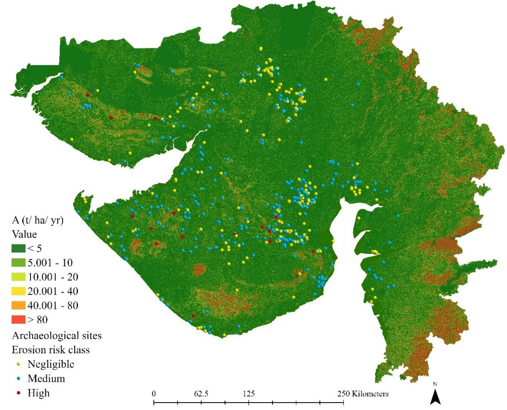
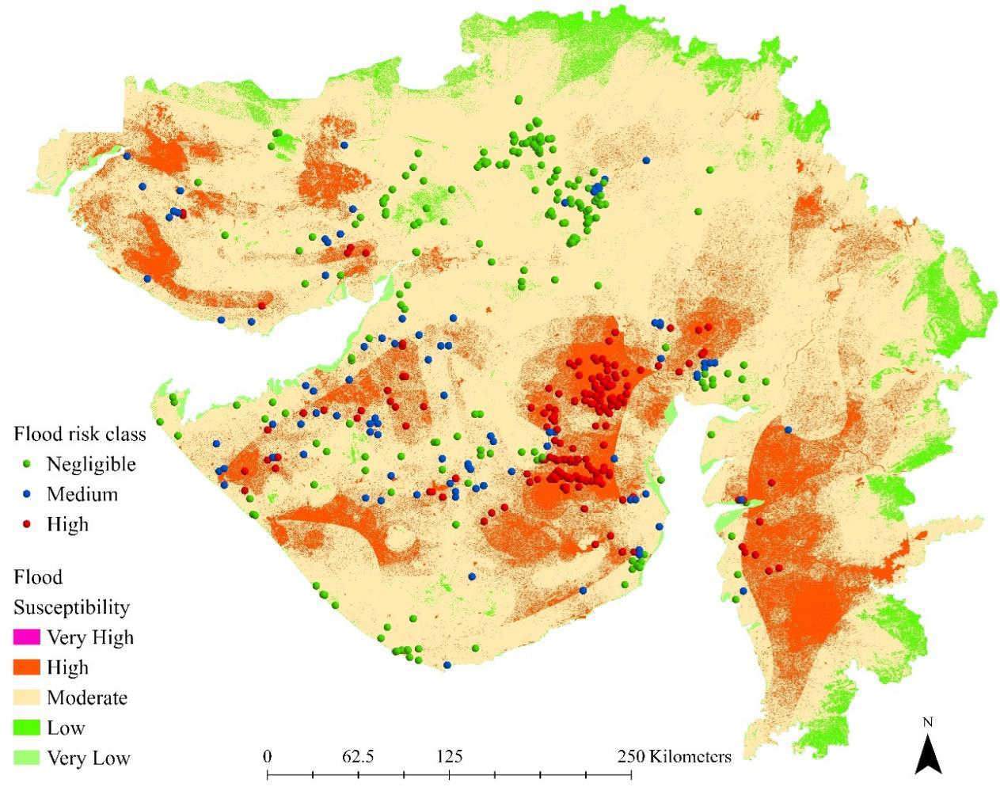
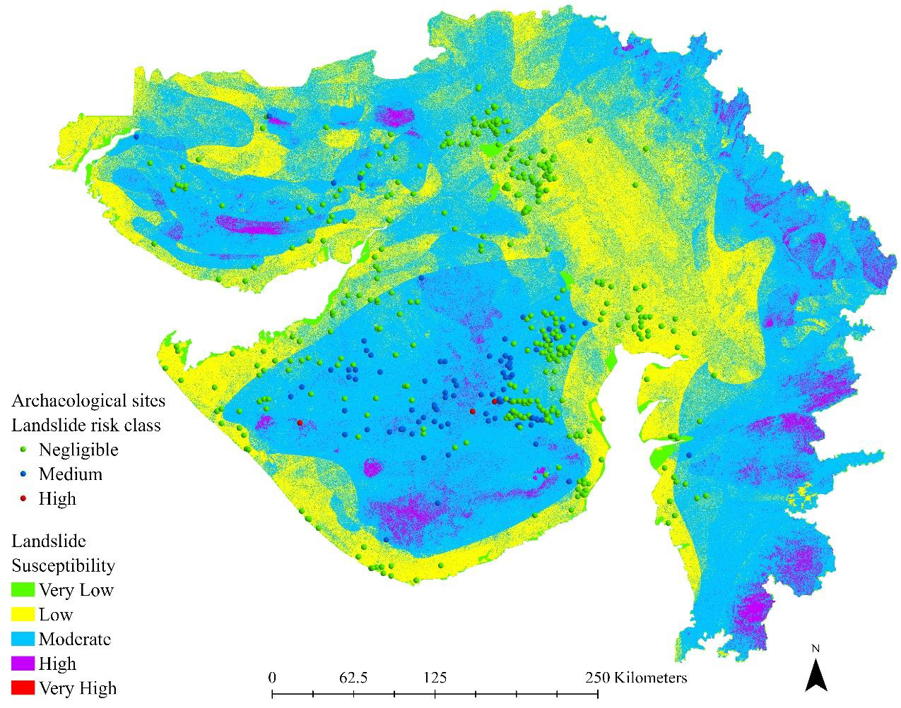
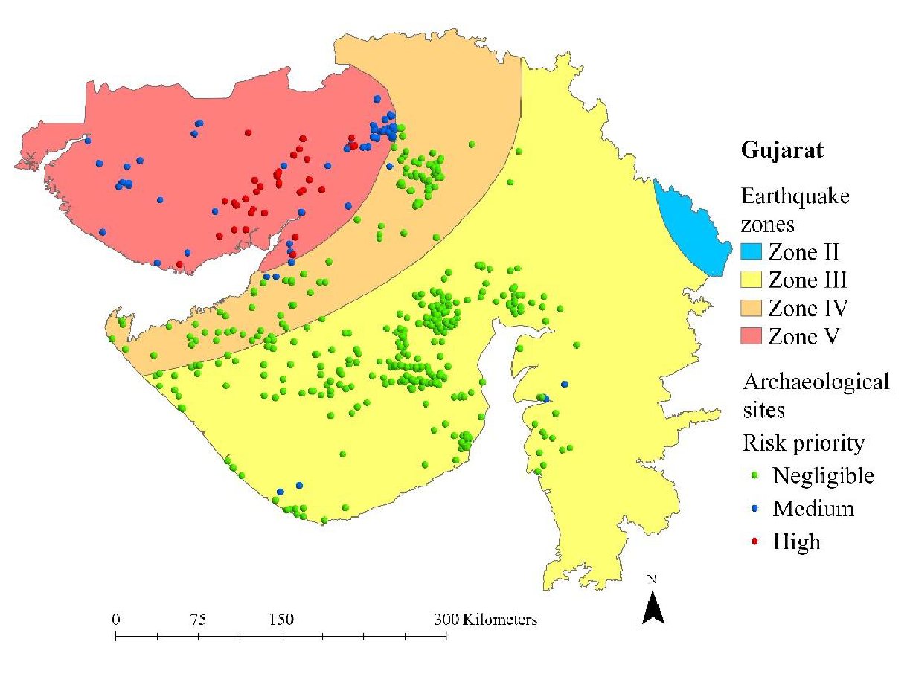
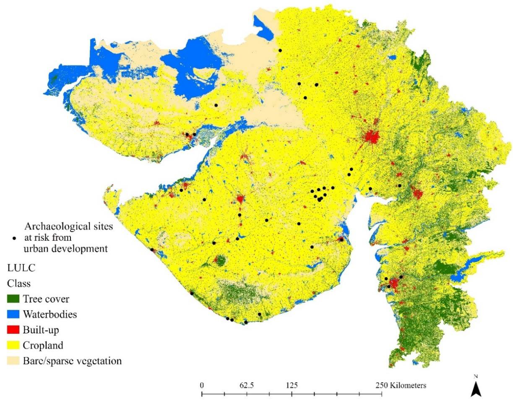
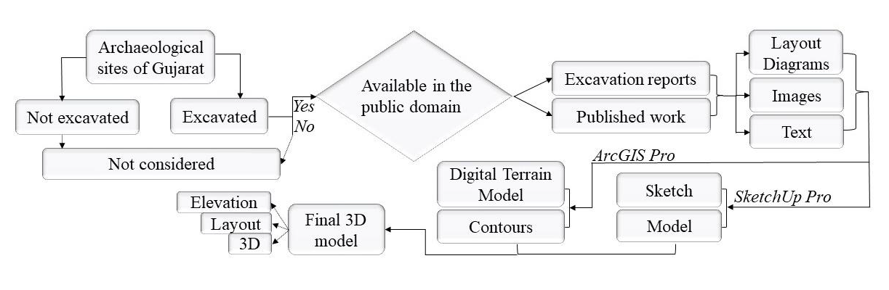

# Heritage Conservation and Site Prioritization Framework

## Overview

Archaeological sites are increasingly threatened by natural hazards, environmental degradation, climate variability, and human-induced pressures. International heritage organizations including UNESCO, ICCROM, ICOMOS, and the Canadian Conservation Institute (CCI) emphasize that effective heritage conservation should be based on systematic risk assessment, vulnerability evaluation, prioritization, and long-term management planning.

This section presents a risk-informed conservation framework developed as part of the PhD research *Risk Assessment and Conservation Strategies of Gujarat Chalcolithic Sites using Remote Sensing and Geographic Information System (GIS)*. The framework integrates multiple hazard assessments, including floods, soil erosion, landslides, earthquakes, and urban encroachment, to support evidence-based conservation planning for archaeological sites.

Rather than treating hazards independently, the approach identifies sites exposed to multiple threats and prioritizes them for monitoring, mitigation, emergency preparedness, and conservation intervention.

For a detailed explanation of the methodology, risk assessment framework, field validation, conservation strategies, and geodatabase development, please refer to **methodology.md**.

---

## Objectives

- Integrate multiple hazard assessments into a unified archaeological risk framework.
- Identify archaeological sites exposed to cumulative and interacting hazards.
- Support conservation decision-making using spatial risk information.
- Prioritize sites requiring immediate, medium-term, and long-term intervention.
- Contribute to disaster risk reduction (DRR) and sustainable heritage management.
- Demonstrate the application of GIS and remote sensing in heritage conservation planning.

---

## International Conservation Context

The conservation framework is informed by internationally recognized approaches developed by UNESCO, ICCROM, ICOMOS, and the Canadian Conservation Institute (CCI).

These frameworks emphasize:

- Identification of hazards affecting cultural heritage.
- Assessment of vulnerability and exposure.
- Evaluation of heritage significance and value.
- Prioritization of conservation actions.
- Integration of risk management into heritage management plans.
- Continuous monitoring and adaptive management.

According to ICCROM and CCI, risk management enables heritage professionals to compare different threats, prioritize conservation actions, and allocate resources more effectively. UNESCO and ICOMOS similarly advocate integrating disaster risk reduction and risk preparedness into cultural heritage management systems.

---

# Hazard Assessments Supporting Conservation Planning

## Soil Erosion Risk Assessment



Soil erosion assessment was conducted using GIS and the Revised Universal Soil Loss Equation (RUSLE) to identify areas susceptible to surface erosion and landscape degradation. The results highlight archaeological sites vulnerable to long-term loss of archaeological deposits.

---

## Flood Risk Assessment



Flood risk assessment identified archaeological sites exposed to seasonal inundation, riverine flooding, and hydrological hazards. These results provide an important basis for prioritizing conservation interventions and site monitoring.


---

## Landslide Susceptibility Assessment



Landslide susceptibility mapping was carried out using Multi-Criteria Decision Making (MCDM) and the Analytical Hierarchy Process (AHP). The assessment identifies archaeological sites located within areas prone to slope instability and mass movement processes.

---

## Earthquake Risk Assessment



Earthquake risk assessment evaluated the potential impacts of seismic hazards on archaeological sites by integrating hazard, exposure, vulnerability, and adaptive capacity indicators. The results help identify sites requiring enhanced preparedness and risk mitigation measures.

---

## Urban Encroachment Assessment



Urban expansion, infrastructure development, and land-use change represent significant threats to archaeological resources. The urban encroachment assessment identifies sites affected by anthropogenic pressures and supports sustainable heritage management strategies.

---

## Conservation Planning Framework

The conservation framework follows a risk-informed approach in which hazard identification, vulnerability assessment, and site significance are combined to support conservation decision-making.

```text
Hazard Assessment
        ↓
Risk Identification
        ↓
Site Prioritization
        ↓
Conservation Planning
        ↓
Monitoring and Review
        ↓
Adaptive Management
```

This approach aligns with international recommendations promoted by UNESCO, ICCROM, ICOMOS, and the Canadian Conservation Institute for integrating risk management into heritage conservation practice.

---

## Digital Documentation and Communication



The study proposes a GIS-based workflow for creating digital three-dimensional representations of archaeological sites using excavation reports, site plans, Digital Terrain Models (DTMs), SketchUp Pro, and ArcGIS Pro. These digital models can support heritage communication, public engagement, education, documentation, and long-term conservation planning.

---

## Significance for Heritage Management

The framework demonstrates how geospatial technologies can support heritage conservation by transforming hazard assessments into practical management information.

The results can assist:

- Archaeological Survey organizations
- Heritage managers
- Conservation professionals
- Government agencies
- UNESCO World Heritage management authorities
- Disaster Risk Reduction (DRR) practitioners
- Researchers and students

in identifying vulnerable sites, allocating resources, prioritizing interventions, and developing long-term conservation strategies.

---

## Publications

### PhD Thesis

Kadapa, H. (2025). *Risk Assessment and Conservation Strategies of Gujarat Chalcolithic Sites using Remote Sensing and Geographic Information System (GIS).* PhD Thesis, Indian Institute of Technology Gandhinagar, India.

### Book Chapter

Kadapa, H. (2025). *Risk Assessment and Conservation Strategies of Gujarat Chalcolithic Sites Using GIS and Remote Sensing*. In: Tsioukas, V., Balla, E., Tzortzis, S., Ioannides, M. (eds) *Digital Heritage. EuroMed 2024*. Lecture Notes in Computer Science, vol. 15618. Springer, Cham.

📖 https://link.springer.com/chapter/10.1007/978-3-031-98379-5_30

---

## Author

**Haritha Kadapa, PhD**  
Indian Institute of Technology Gandhinagar

### Research Interests

Cultural Heritage Risk Assessment • Heritage Conservation Planning • GIS • Remote Sensing • Archaeological Site Management • Disaster Risk Reduction • Spatial Analysis • Environmental Modelling • Geospatial Databases • Digital Heritage
