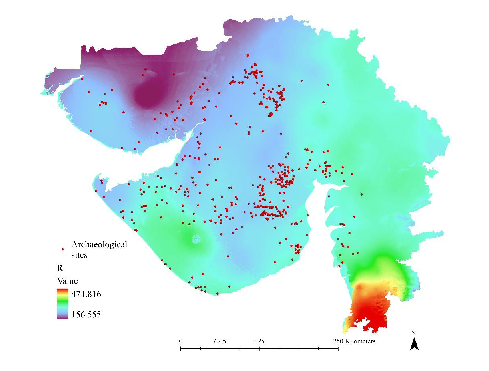
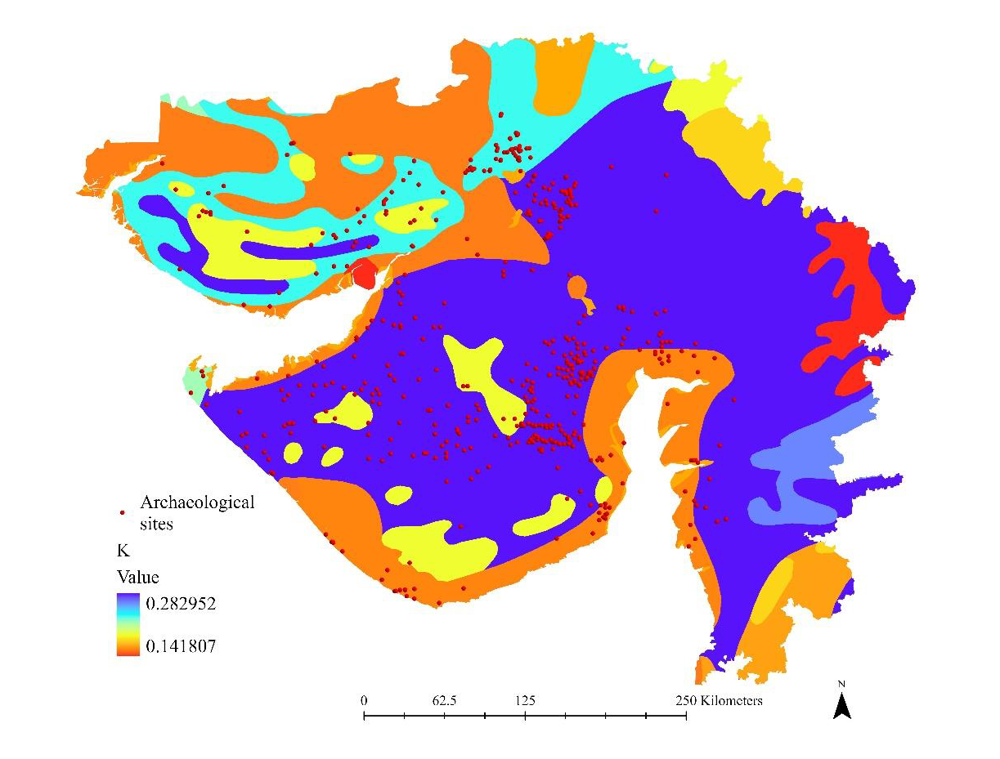
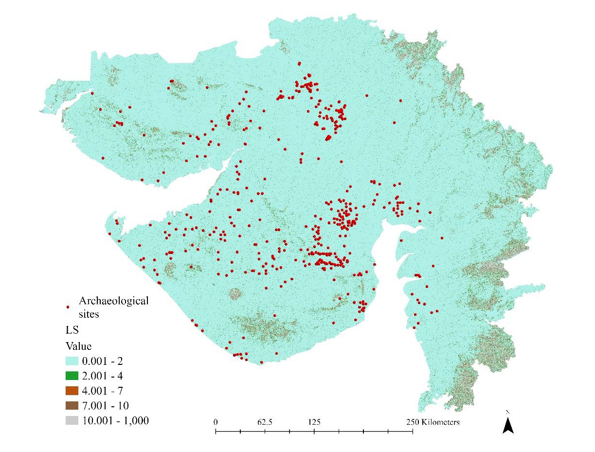
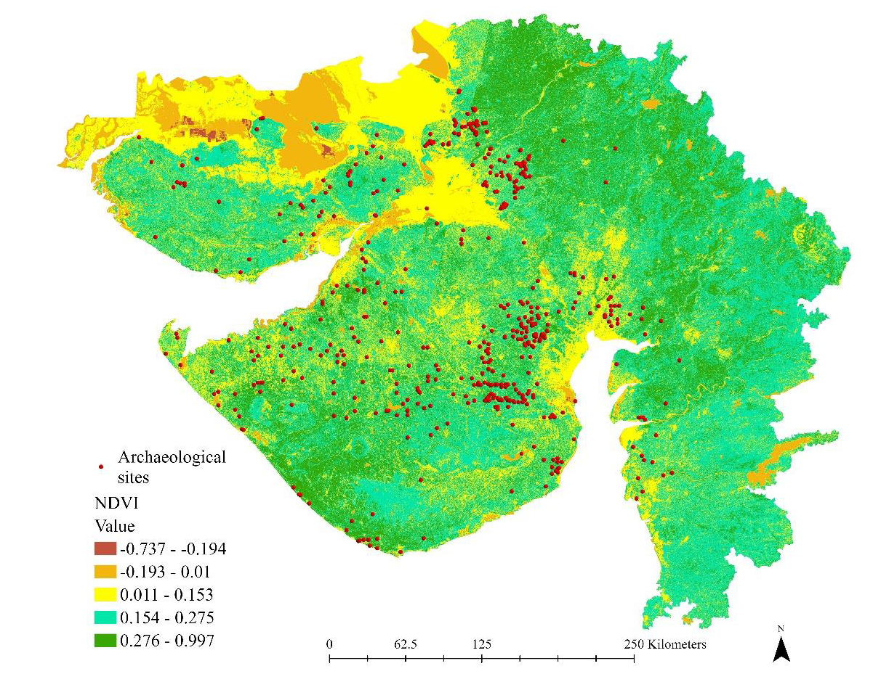
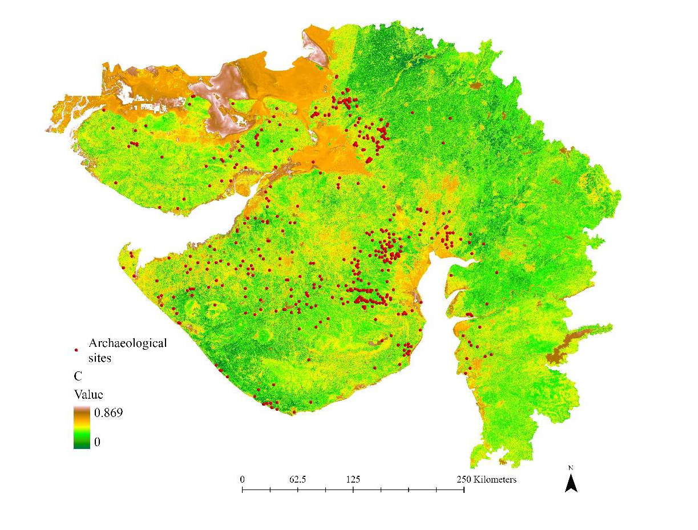
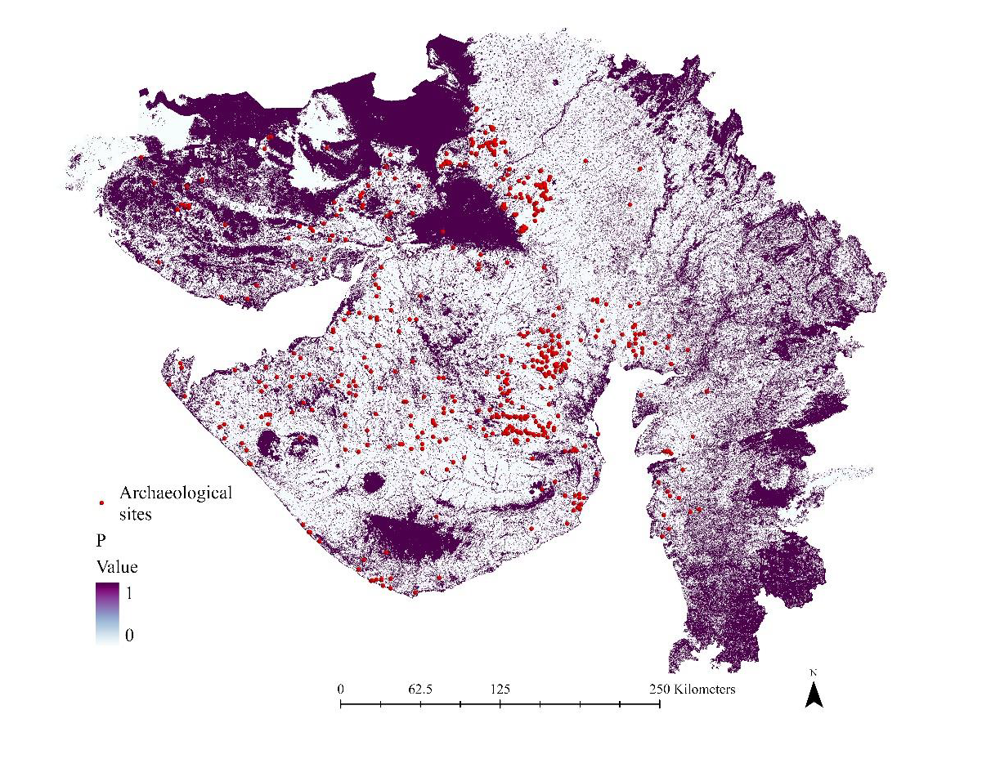
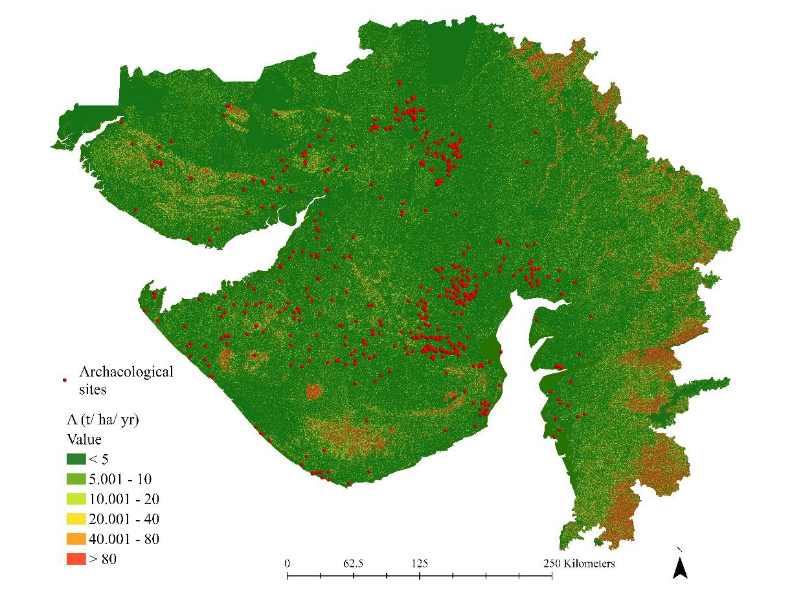

# Soil Erosion Risk Assessment of Gujarat Using GIS, Remote Sensing and RUSLE

*A GIS-based soil erosion modelling project using the Revised Universal Soil Loss Equation (RUSLE), Remote Sensing, and Spatial Analysis.*

---

## Overview

Soil erosion is one of the most significant forms of land degradation and can have substantial impacts on environmental resources, infrastructure, agricultural productivity, and cultural heritage landscapes. Understanding spatial patterns of erosion is essential for sustainable land management, conservation planning, and risk reduction.

This project presents a soil erosion risk assessment of Gujarat, India, using Geographic Information Systems (GIS), Remote Sensing, and the Revised Universal Soil Loss Equation (RUSLE). The study was conducted as part of my PhD research at the Indian Institute of Technology Gandhinagar (IITGN).

The objective was to quantify potential soil loss across Gujarat and identify areas vulnerable to erosion through the integration of climatic, topographic, soil, and vegetation-related factors.

---

## Objectives

- Assess soil erosion risk across Gujarat using the RUSLE model.
- Integrate environmental and terrain variables within a GIS environment.
- Generate spatially explicit soil loss estimates.
- Identify erosion-prone areas for risk assessment and conservation planning.
- Demonstrate the application of GIS and Remote Sensing for environmental modelling and decision support.

---

## Study Area

The study covers the state of Gujarat, India, which exhibits diverse geological, climatic, and topographic conditions. Variations in rainfall, land cover, soil characteristics, and terrain make the region suitable for large-scale soil erosion modelling and spatial risk assessment.

---

## Methodology

The assessment was conducted using the Revised Universal Soil Loss Equation (RUSLE):

```text
A = R × K × LS × C × P
```

where:

- A = Average Annual Soil Loss
- R = Rainfall Erosivity Factor
- K = Soil Erodibility Factor
- LS = Slope Length and Steepness Factor
- C = Crop Management Factor
- P = Conservation Practice Factor

The factors were generated using GIS and Remote Sensing datasets and integrated within ArcGIS to estimate annual soil loss across Gujarat.

📖 A detailed explanation of the methodology, formulas, data sources, GIS workflow, and model validation is available in [methodology.md](methodology.md).

---

## RUSLE Factors

### Rainfall Erosivity Factor (R)



---

### Soil Erodibility Factor (K)



---

### Slope Length and Steepness Factor (LS)



---

### Normalized Difference Vegetation Index (NDVI)



---

### Crop Management Factor (C)



---

### Conservation Practice Factor (P)



---

## Soil Erosion Risk Assessment

### Average Annual Soil Loss Map



The final soil erosion map identifies areas with varying levels of erosion susceptibility across Gujarat and demonstrates the integration of climatic, topographic, soil, and vegetation factors within a GIS-based environmental modelling framework.

---

## Applications

- Soil Erosion Assessment
- Environmental Risk Assessment
- Land Degradation Studies
- Watershed Management
- Conservation Planning
- Spatial Decision Support
- Natural Resource Management
- Heritage Landscape Risk Assessment

---

## Tools and Technologies

- ArcGIS Pro
- ArcGIS Spatial Analyst
- Remote Sensing
- RUSLE Modelling
- Raster Analysis
- Terrain Analysis
- Spatial Analysis
- Geospatial Modelling

---

## Related Research

This project forms part of my doctoral research on assessing natural and anthropogenic risks affecting cultural heritage landscapes through GIS, Remote Sensing, and spatial risk assessment approaches.

**Kadapa, H. (2026).** *Hazards, Risks, and Conservation Measures: A Heritage Impact Assessment Geodatabase of Indus Civilization and Chalcolithic Sites of Gujarat, India.* In: Furferi, R., Governi, L., Volpe, Y., Gherardini, F., Seymour, K. (eds) *The Future of Heritage Science and Technologies II*. Florence Heri-Tech 2024. Lecture Notes in Mechanical Engineering. Springer, Cham.

📖 Read the publication:

https://doi.org/10.1007/978-3-031-98379-5_30

---

## Author

**Haritha Kadapa, PhD**

Indian Institute of Technology Gandhinagar

**Research Interests:**  
GIS • Remote Sensing • Spatial Analysis • Environmental Modelling • Soil Erosion Assessment • Disaster Risk Assessment • Geospatial Decision Support Systems
