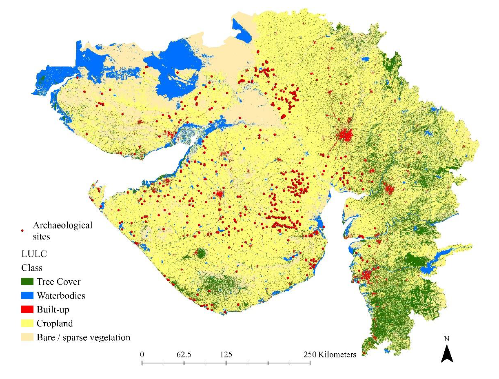

# Methodology

## Overview

This project evaluates urban encroachment around archaeological sites in Gujarat, India, using Geographic Information Systems (GIS) and Remote Sensing techniques. The analysis focuses on identifying built-up areas, assessing their proximity to archaeological sites, and evaluating the impact of urban development on cultural heritage resources.

The methodology integrates Land Use Land Cover (LULC) classification, spatial analysis, buffer generation, overlay analysis, and accuracy assessment to identify archaeological sites exposed to urban development pressure.

---

## Methodological Workflow

```text
Satellite Imagery
        ↓
Land Use Land Cover (LULC) Classification
        ↓
Accuracy Assessment
        ↓
Built-up Area Identification
        ↓
Archaeological Site Database Integration
        ↓
Buffer Generation
        ↓
Spatial Overlay Analysis
        ↓
Urban Encroachment Assessment
        ↓
Risk Evaluation
```

---

## Data Sources

The analysis utilized multiple spatial datasets, including:

- Satellite imagery
- Land Use Land Cover (LULC) data
- Archaeological site locations
- Administrative boundaries
- Ancillary spatial datasets

All datasets were processed within a GIS environment and projected to a common coordinate system before analysis.

---

## Land Use Land Cover (LULC) Classification

Land Use Land Cover (LULC) mapping was used to identify built-up areas and other major land-use categories across Gujarat.

The classification was divided into five classes:

- Tree Cover
- Bare / Sparse Vegetation
- Built-up
- Cropland
- Waterbodies

The resulting LULC dataset provided the foundation for identifying urban development patterns and evaluating development pressure around archaeological sites.



---

## Accuracy Assessment

The accuracy of the Land Use Land Cover (LULC) dataset was evaluated using a post-classification accuracy assessment.

A total of **90 random validation points** were generated across the study area and compared with ground reference data.

The classification accuracy was assessed using a confusion matrix and the Kappa Coefficient. According to McHugh (2012), Kappa coefficient values range from 0 to 1, with values of **0.61–0.80 indicating substantial agreement** and **0.81–1.00 indicating almost perfect agreement**.

### Confusion Matrix

| LULC Class | Tree Cover | Bare/Sparse Vegetation | Built-up | Cropland | Waterbodies | Total | User Accuracy |
|------------|------------|------------|------------|------------|------------|------------|------------|
| Tree Cover | 13 | 0 | 0 | 2 | 0 | 15 | 0.87 |
| Bare/Sparse Vegetation | 0 | 25 | 0 | 0 | 1 | 26 | 0.96 |
| Built-up | 0 | 0 | 8 | 0 | 0 | 8 | 1.00 |
| Cropland | 0 | 1 | 0 | 29 | 0 | 30 | 0.97 |
| Waterbodies | 0 | 2 | 0 | 0 | 9 | 11 | 0.82 |
| **Total** | **13** | **28** | **8** | **31** | **10** | **90** | |
| **Producer Accuracy** | **1.00** | **0.89** | **1.00** | **0.94** | **0.90** | | **0.93** |

### Kappa Coefficient

| Metric | Value |
|----------|----------|
| Kappa Coefficient | 0.91 |

The resulting **Kappa coefficient of 0.91** indicates almost perfect agreement between the classified dataset and ground reference data, demonstrating the reliability of the LULC classification used in the urban encroachment assessment.

---

## Archaeological Site Database

A geospatial database of archaeological sites was integrated with the LULC dataset to support spatial analysis.

The database included:

- Site locations
- Site attributes
- Cultural heritage information
- Hazard and risk information
- Conservation-related attributes

The integration of archaeological and environmental datasets enabled the assessment of anthropogenic threats affecting cultural heritage resources.

---

## Buffer Analysis

Buffer zones were generated around archaeological sites to evaluate the influence of nearby urban development.

Buffer analysis enabled the identification of sites located within areas experiencing urban expansion and increasing development pressure.

The generated buffers were subsequently used for overlay analysis with built-up land-use categories.

---

## Spatial Overlay Analysis

Spatial overlay techniques were used to examine the relationship between archaeological sites and urban land-use categories.

The analysis enabled:

- Identification of sites affected by urban development
- Assessment of encroachment patterns
- Evaluation of development pressure
- Quantification of urban influence around archaeological sites

Overlay analysis provided a spatial framework for identifying sites vulnerable to urban expansion.

---

## Urban Encroachment Assessment

Urban encroachment was assessed by analysing the spatial interaction between archaeological sites and surrounding built-up areas.

Areas exhibiting increasing urban development were identified as locations requiring enhanced monitoring and conservation planning.

The assessment enabled the identification of archaeological sites exposed to anthropogenic threats resulting from urban growth and infrastructure development.

---

## Results Interpretation

The resulting spatial analysis provided:

- Identification of sites exposed to urban development pressure
- Assessment of urban encroachment patterns
- Evaluation of anthropogenic threats
- Support for heritage management and conservation planning
- Spatial evidence for prioritizing monitoring and intervention efforts

The results demonstrate the effectiveness of GIS and Remote Sensing techniques for assessing land-use change and its impacts on cultural heritage resources.

---

## Software and Tools

- ArcGIS Pro
- ArcGIS Spatial Analyst
- Remote Sensing Data
- GIS-Based Spatial Analysis
- Buffer Analysis
- Overlay Analysis
- Spatial Statistics

---

## Applications

This methodology can support:

- Urban Growth Monitoring
- Land Use Change Analysis
- Heritage Risk Assessment
- Conservation Planning
- Environmental Impact Assessment
- Spatial Decision Support Systems
